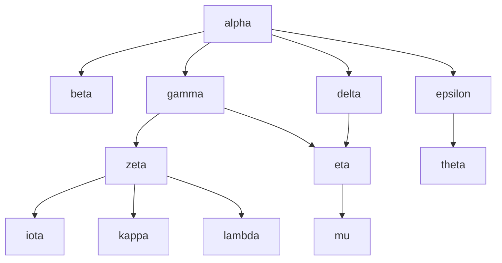

# Graph Traversal

The algorithms below illustrate different strategies to traverse a graph.  Each
one visits the vertices in a different order. The graph below, with random
labels, will be used as example.



The algorithms use [adjacency lists](./representation.md#adjacency-list) to
represent the graph $G=(V, E)$. Each vertex $v \in V$ contains a list of edges
$E(v) \subseteq E$ that connect it to another vertex $u \in V$.  We denote the
set of vertices connected to $v$ as $V(v)$. All algorithms run in $O(|E| +
|V|)$.

```c
#define MAX_VERTICES  1000

typedef struct {
    int edge[MAX_VERTICES][MAX_VERTICES];
    int num_edges[MAX_VERTICES];
    char visited[MAX_VERTICES];  /* either 0 or 1 */
    int num_vertices;
} graph_t;

```

## Depth-First Search

In a depth-first search, we use a [stack](../structure/stack.md) to store and
retrieve the vertices that are reachable from a starting vertex $v \in V$.  It
makes the traversal fully explore a connected vertex $x \in V(v)$ before
visiting the next connected vertex $y \in V(v), y \neq x$.  The graph in the
example would be traversed in the following order:

<center>
(alpha, beta, gamma, zeta, iota, kappa, lambda, eta, mu, delta, epsilon, theta)
</center>

```c
#include <string.h>

void visit_vertex(graph_t *graph, int vertex) {
    int stack[MAX_VERTICES], top, e;
    stack[0] = vertex, top = 1, graph[vertex]->visited = 1;
    while (top > 0) {
        vertex = stack[--top];
        printf("%d\n", vertex);
        for (e = 0; e < graph->num_edges[vertex]; e++) {
            int next = graph->edge[vertex][e];
            if (!graph->visited[next]) {
                stack[top++] = next;
                graph->visited[next] = 1;
            }
        }
    }
}

void traverse(graph_t *graph) {
    int v;
    memset(graph->visited, 0, sizeof (int) * graph->num_vertices);
    for (v = 0; v < graph->num_vertices; v++) {
        if (!graph->visied[v]) visit_vertex(graph, v);
    }
}
```

Since the traversal uses a stack, we might implement it using recursive calls to
visit each vertex.

```c
void visit_vertex(graph_t *graph, int vertex) {
    int e;
    graph[vertex]->visited = 1;
    printf("%d\n", vertex);
    for (e = 0; e < graph->num_edges[vertex]; e++) {
        int next = graph->edge[vertex][e];
        if (!graph->visited[next]) visit_vertex(graph, next);
    }
}
```

## Breadth-First Search

In a breadth-first search, we use a [queue](../structure/queue.md) to store and
retrieve the vertices. When exploring a vertex $v \in V$, we first visit each of
its connected vertices $V(v)$, and then we proceed in the exploration.  The
graph in the example above would be traversed in the following order:

<center>
(alpha, beta, gamma, delta, epsilon, zeta, eta, theta, iota, kappa, lambda, mu)
</center>

The algorithm is exactly the same as depth-first search, except for the queue.

```c
void visit_vertex(queue_t* queue, int vertex) {
    int queue[MAX_VERTICES], head, tail, e;
    queue[0] = vertex, head = 0, tail = 1, graph[vertex]->visited = 1;
    while (head < tail) {
        vertex = queue[head++];
        vertex = stack[--top];
        for (e = 0; e < graph->num_edges[vertex]; e++) {
            int next = graph->edge[vertex][e];
            if (!graph->visited[next]) {
                queue[tail++] = next;
                graph->visited[next] = 1;
            }
        }
    }
}
```

## Topological Sort

A topological sort lists the vertices of a [directed acyclic
graph](./connection.md) in such a way that, if there is a sequence of edges from
vertex $a$ to vertex $b$, then $a$ appears before $b$ in the list, $\forall a, b
\in V$. (Since the graph is acyclic, if $a \leadsto b$, then $b \not\leadsto
a$.)

**Input** A directed acyclic graph $G=(V,E)$ \
**Output** An ordered sequence $(v_1, \ldots, v_n)$ of $V$ such that
         $\forall v_i, v_j \in V: (v_i, v_j) \in E \Rightarrow i < j$ \
**Time** $O(|V| + |E|)$

To sort the vertices in topological order, we use an algorithm similar to
[depth-first search](#depth-first-search), with the following modifications:

1. When we visit vertex $v \in V$, after fully exploring the vertices $V(v)$
   connected to it, we add $v$ to the sorted list;
2. After vising all vertices, we invert the sorted list.

For the graph in the example above, topological sort produces the following
ordering:

<center>
(alpha, epsilon, theta, delta, gamma, eta, mu, zeta, lambda, kappa, iota, beta)
</center>


```c
#include <string.h>

typedef struct {
    ...
    int sorted[MAX_VERTICES]; /* index of 1st vertex, 2nd, etc. */
} graph_t;

void visit_vertex(graph_t *graph, int vertex, int *index) {
    int e;
    graph[vertex]->visited = 1;
    for (e = 0; e < graph->num_edges[vertex]; e++) {
        int next = graph->edge[vertex][e];
        if (!graph->visited[next]) visit_vertex(graph, next, index);
    }
    graph->sorted[(*index)++] = vertex;
}

void topological_sort(graph_t *graph) {
    int i, j, index;
    memset(graph->visited, 0, sizeof (int) * graph->num_vertices);
    index = 0;
    for (i = 0; i < graph->num_vertices; i++) {
        if (!graph->visited[i]) visit_vertex(graph, vertex, &index);
    }
    for (i = 0, j = graph->num_vertices - 1; i < j; i++, j--) {
        int swap = list[i];
        list[i] = list[j];
        list[j] = swap;
    }
}
```
