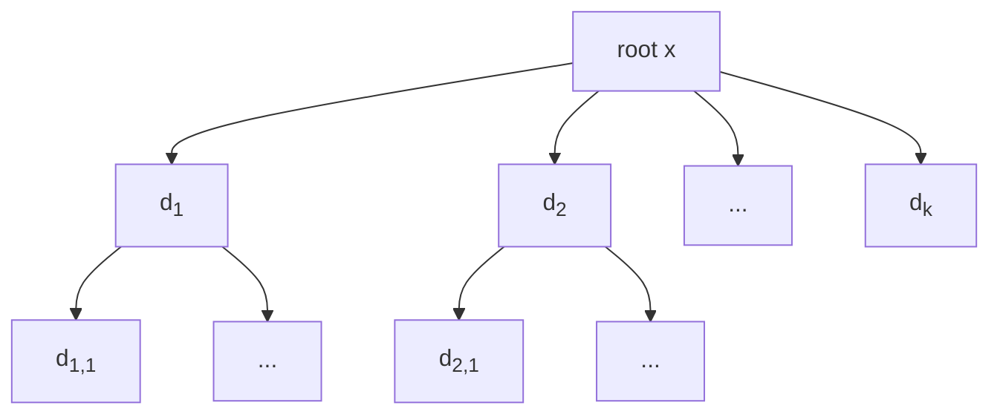
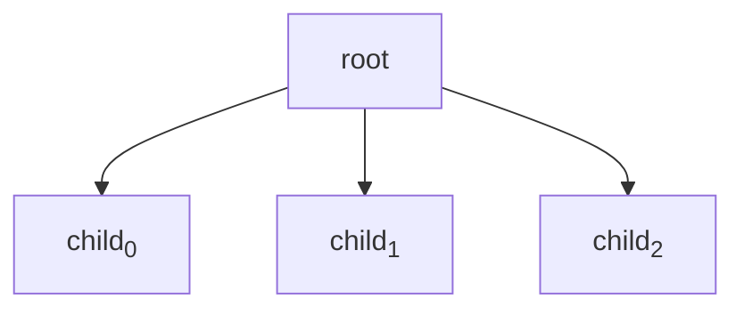
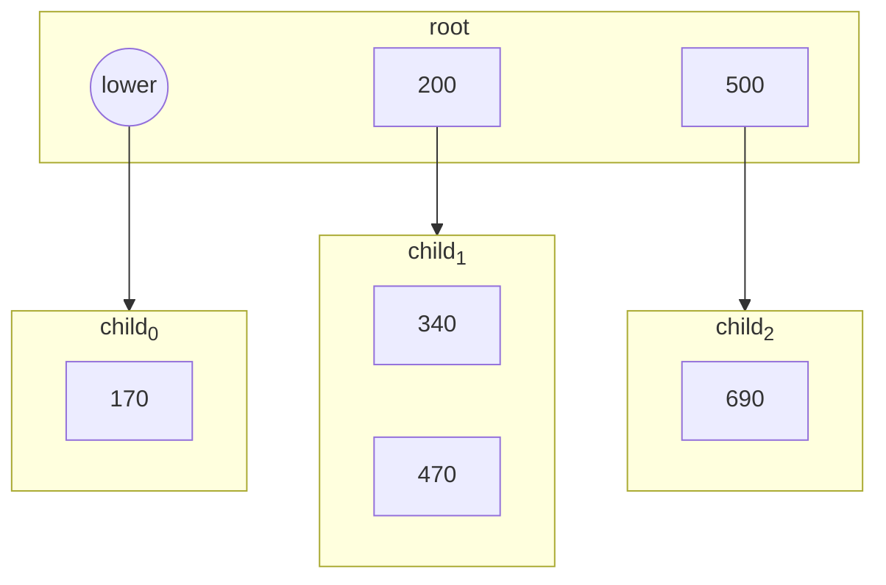
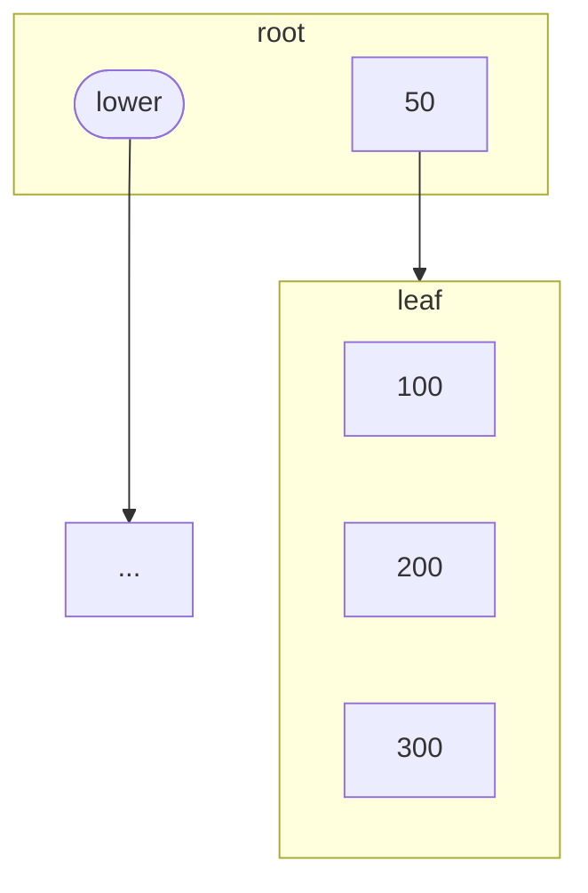
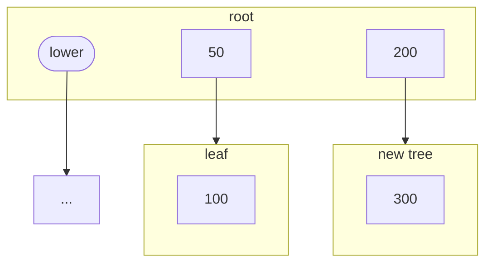

# B-trees

Trees are recursive structures composed of nodes. A node is either a single leaf
or a root that branches out into different nodes. Let $h(x)$ denote the height
of the tree that branches from $x$, and let $\delta(x) = \{d_1, \ldots, d_k\}$
denote its $k$ descendant nodes. We have that

$$h(x) = 1 + \max_{d \in \delta(x)}\{ h(d) \}$$



A tree is called *balanced* if, for any node $x$ of the tree, the height of its
descendants does not differ by more than 1. That is,

$$|h(a) - h(b)| \leq 1, ~\forall a, b \in \delta(x)$$

This property ensures that the height $h$ of a tree with $n$ nodes does not grow
beyond $O(\log{n})$, which allows us to quickly traverse from the root node to
any leaf.  It makes balanced trees very effective for inserting and retrieving
data. There are many flavors of balanced trees, specially binary trees. In this
section, we present a B-tree.


## Structure

B-trees are a type of balanced trees. Every node of a B-tree (except the root)
contains between $k/2$ and $k$ elements, where $k$ is a parameter of the B-tree.
The elements inside a node are sorted. Each element has a descendant tree with
elements greater than it, but lesser than its sibling element. The node itself
also has a descendant tree, which holds lower elements.  The following example
illustrates a B-tree with $k=2$.




```c
#include <stdlib.h>

const int ORDER = 2;

struct bnode_s;

typedef struct {
    int value;
    struct bnode_s *greater;
} belem_t;

typedef struct bnode_s {
    belem_t data[ORDER + 1];
    int size;
    struct bnode_s *lower;
} bnode_t;

typedef struct {
    bnode_t *root;
} btree_t;

bnode_t * create_bnode() {
    bnode_t *node = (bnode_t *) malloc(sizeof (bnode_t));
    node->size = 0;
    node->lower = NULL;
    return node;
}

void init(btree_t *tree) {
    tree->root = create_bnode();
}
```


## Search

Search for an element in the B-tree.

**Input** A B-tree with $n$ elements, and a value $x$ \
**Output** The element with value $x$, if it is present \
**Time** $O(\log{n})$

We start the search from a node, selecting the largest element $e$ such that
$e \leq x$. If $e = x$, we have found the element. If not, we descend into
$e$'s tree and repeat the search. If there is no such $e$, we search the node's
descendant tree that contains lower elements.

```c
int find_index(bnode_t *node, int value) {
    int index = 0;
    while (index < node->size && node->data[index].value <= value) {
        index++;
    }
    return index - 1;
}

int * search_bnode(bnode_t *node, int value) {
    int index = find_index(node, value);
    if (index >= 0 && node->data[index].value == value) {
        return &node->data[index].value;
    } else if (index >= 0 && node->data[index].greater != NULL) {
        return search_bnode(node->data[index].greater, value);
    } else if (index < 0 && node->lower != NULL) {
        return search_bnode(node->lower, key);
    }
    return NULL;
}

int * search(btree_t *tree, int value) {
    return search_bnode(tree->root, value);
}
```


## Insertion

Insert a new element in the B-tree.

**Input** A B-tree with $n$ elements, and a value $x$ \
**Effect** Value $x$ is inserted in the B-tree \
**Time** $O(\log{n})$

To insert a new value in a B-tree, we first descend to the leaf node that will
contain the new element and insert it at the correct position of the vector. If
the node ends up holding $k + 1$ elements, we must split it in half.  The first
$k/2$ elements remain in the node, while the last $k/2$ are moved into a new
tree $t$. The excess element $e$ at the middle of the vector has its descendant
tree moved into the lower branch of $t$. We set $t$ as the new descendant of
$e$, and proceed to insert $e$ into the parent node, following the same steps.
If the root node ends up being split, we must create a new root node to store
the ascending element that will come, and move the previous root into the lower
branch of the new root.

Example: after an element is inserted in a leaf node, the node has more elements
than is allowed ($k$ = 2). It must be split.



After the split, the middle element ascends. It has a new descendant tree
that holds its (previous) larger siblings.



```c
#include <assert.h>

belem_t * insert_with_split(bnode_t *node, int value) {
    int index, i;
    belem_t temporary, *element;
    if (node->lower == NULL) { /* leaf */
        temporary.value = value;
        temporary.greater = NULL;
        element = &temporary;
    } else { /* not a leaf */
        index = find_index(node, key);
        if (index >= 0 && node->data[index].value == value) return NULL;
        element = insert_with_split(index < 0 ? node->lower
                : node->data[index].greater, value);
        if (element == NULL) return NULL;
    }
    index = find_index(node, element->value) + 1;
    for (i = node->size++; i > index; i--) {
        node->data[i] = node->data[i - 1];
    }
    node->data[index] = *element;
    if (node->size > ORDER) {
        int middle = ORDER / 2;
        bnode_t *split = create_bnode();
        for (i = middle + 1; i < node->size; i++) {
            split->data[split->size++] = node->data[i];
        }
        split->lower = split->vector[middle].greater;
        node->vector[middle].greater = split;
        node->size = middle;
        return &node->vector[middle];
    }
    return NULL;
}

void insert(btree_t *tree, int value) {
    belem_t *element = insert_with_split(tree->root, value);
    if (element != NULL) {
        bnode_t *new_root = create_bnode();
        new_root->data[0] = *element;
        new_root->lower = tree->root;
        new_root->size = 1;
        tree->root = new_root;
    }
}
```
