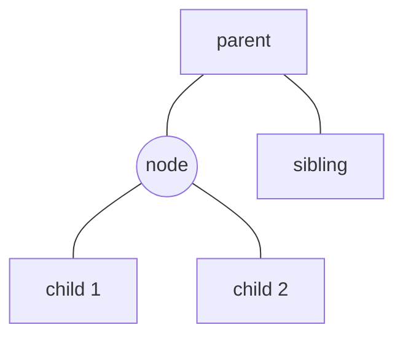

# Heaps

Heaps are used to efficiently retrieve the smallest element of a data set.
Peeking this element is done in $O(1)$, while insertion and removal are done in
$O(\log{n})$. Heaps are used to implement priority queues, a type of
[queue](./queue.md) where the smallest element is retrieved first instead of the
first-inserted element.


## Structure

A heap is logically designed as a balanced binary tree, but instead of using
linked lists, we use a fixed-size vector to store the data. Given a node stored
in the vector at index $i$, we compute the indices of its parent $p(i)$ and its
children $c(i)$ as follows:

$$p(i) = \lfloor (i - 1) / 2 \rfloor$$

$$c(i) = \left(2 \, i + 1,\: 2 \, i + 2\right)$$



The value of node is always equal or greater than its parent. Therefore, the
smallest element is always located at the root of the tree, which has index 0.

```c
const int MAX_SIZE = 10000;

typedef struct {
    int data[MAX_SIZE];
    int size;
} heap_t;

void init(heap_t *heap) {
    heap->size = 0;
}

int * minimum(heap_t *heap) {
    return heap->size > 0 ? &heap->data[0] : NULL;
}

int parent(int i) {
    return (i - 1) / 2;
}

int left_child(int i) {
    return (2 * i) + 1;
}

int right_child(int i) {
    return (2 * i) + 2;
}
```

## Insertion

Insert an element in a heap.

**Input** A heap containing $n$ elements, and a value $x$ \
**Effect** The heap contains $x$ \
**Time** $O(\log{n})$

To insert a new element $x$, we place it at the bottom of the binary tree, and
compare it to its parent. If $x$ is smaller, we swap the elements, and compare
it again to its new parent. We continue until its parent is no longer larger.

```c
void swap(int vector[], int a, int b) {
    int temp = vector[a];
    vector[a] = vector[b];
    vector[b] = temp;
}

void move_up(heap_t *heap, int index) {
    while (index > 0 && heap->data[parent(index)] > heap->data[index]) {
        swap(heap->data, index, parent(index));
        index = parent(index);
    }
}

void insert(heap_t *heap, int value) {
    heap->data[heap->size++] = value;
    move_up(heap, heap->size - 1);
}
```


## Removal

Remove the smallest element from the heap.

**Input** A heap containing $n$ elements \
**Effect** The smallest element is removed from the heap \
**Time** $O(\log{n})$

By definition, the smallest element is at the root of the heap. To remove it, we
replace it with an element $x$ from the bottom of the binary tree, and then
compare the new root $x$ with its two children. If the smallest child is smaller
than $x$, we swap them, and compare $x$ again to its new children. We continue
this process until there are no more smaller children.

```c
#include <assert.h>

void move_down(heap_t *heap, int index) {
    while (left_child(index) < heap->size) {
        int smallest = left_child(index);
        int right = right_child(index);
        if (right < heap->size && heap->data[right] < heap->data[smallest]) {
            smallest = right;
        }
        if (heap->data[smallest] >= heap->data[index]) break;
        swap(heap->data, smallest, index);
        index = smallest;
    }
}

int remove(heap_t *heap) {
    int value = heap->data[0]
    assert(heap->size > 0);
    heap->vector[0] = heap->vector[--heap->size];
    move_down(heap, 0);
    return value;
}
```


## Construction

Build a heap from a list of elements.

**Input** A list of $n$ elements \
**Output** A heap containing these $n$ elements \
**Time** $O(n)$

First we copy the $n$ elements into the heap data vector. Then we must correct
it so that each node is smaller than its children. To do that, we simply apply
the method `move_down` to every element of the vector, starting from the last.
This strategy to build a heap is slightly more efficient than performing $n$
insertions in the heap.

```c
#include <string.h>

void build_heap(heap_t *heap, int list[], int size) {
    int i;
    memcpy(heap->data, list, size * sizeof (int));
    for (i = parent(size - 1); i >= 0; i--) {
        move_down(heap, i);
    }
}
```
