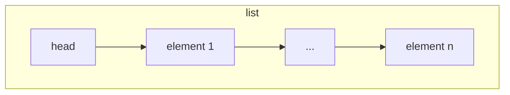
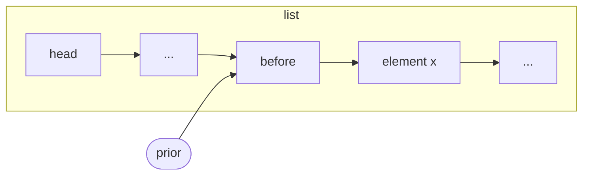
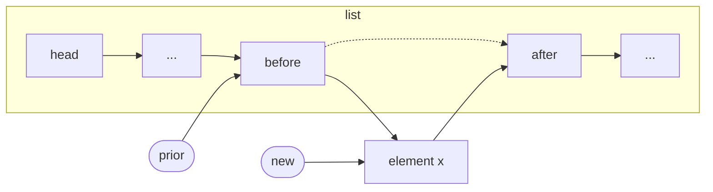
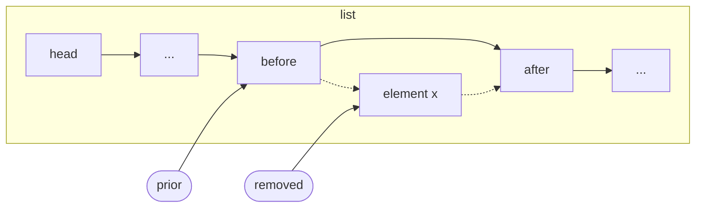

# Linked Lists

Linked lists contain an unbounded number of elements linked together by
explicit pointers. In this section, we deal with linear linked lists that
represent sequences of elements. New elements can be inserted at the beginning
or at the end of the list in $O(1)$.

## Structure

In a simple linear linked list, each element is represented by a node that
stores a value and a pointer to the next node. To represent the list, we use an
empty head node instead of a pointer to the first element, as it simplifies the
computation.



We initialize the list by setting the head pointer to `NULL`. It signals that
the list is empty. We also keep a pointer to the last element, and when the list
is empty, it points to the head.


```c
typedef struct node_s {
    int value;
    struct node_s *next;
} node_t;

typedef struct {
    node_t head;
    node_t *last;
} list_t;

void init(list_t *list) {
    list->head.next = NULL;
    list->last = &list->head;
}

int is_empty(list_t *list) {
    return list->head.next == NULL;
}
```


Search
------

Search for an element in the linked list.

**Input** A simple linked list with $n$ elements, and a value $x$ \
**Output** The node that contains $x$, or `NULL` if it is not present \
**Time** $O(n)$

In order to reuse this code later, we implement a function `get_prior` that
returns a prior node pointing to the one we seek. This function is guaranteed to
return a value different than `NULL`, since we use a head node.



With a small change in the search condition, we can implement a sorted linked
list. If the element $x$ is not found, `get_prior` returns the node that should
come before $x$.

```c
/* Unsorted list */
node_t * get_prior(list_t *list, int value) {
    node_t *node = &list->head;
    while (node->next != NULL && node->next->value != value) {
        node = node->next;
    }
    return node;
}

/* Sorted list */
node_t * get_prior(list_t *list, int value) {
    node_t *node = &list->head;
    while (node->next != NULL && node->next->value < value) {
        node = node->next;
    }
    return node;
}

node_t * search(list_t *list, int value) {
    node_t *prior = get_prior(list, value);
    return prior->next != NULL && prior->next->value == value
            ? prior->next : NULL;
}
```


## Insertion

Insert an element in the linked list.

**Input** A simple linked list with $n$ elements, and a new value $x$ to be
inserted \
**Effect** Value $x$ is inserted in the list \
**Time** $O(1)$

In an unsorted list, insertion may be performed right after the head node or
after the last node.  In a sorted list, we must search the correct point to
perform the insertion, and thus it runs in $O(n)$.



```c
#include <stdlib.h>

node_t * insert_after(node_t *prior, int value) {
    node_t *node = (node_t *) malloc(sizeof (node_t));
    node->value = value;
    node->next = prior->next;
    prior->next = node;
    return node;
}

void insert_at_start(list_t *list, int value) {
    node_t *node = insert_after(&list->head, value);
    if (list->last == &list->head) list->last = node;
}

void insert_at_end(list_t *list, int value) {
    list->last = insert_after(list->last, value);
}

/* Sorted list */
void insert(list_t *list, int value) {
    node_t *prior = get_prior(list, value);
    node_t *node = insert_after(prior, value);
    if (list->last == prior) list->last = node;
}
```


## Removal

Remove an element from the linked list.

**Input** A simple linked list with $n$ elements, and a value $x$ to be
removed \
**Effect** Value $x$ is removed from the list, if it was present \
**Time** $O(n)$

If the element to be removed is always the first in the list, it can be done in
$O(1)$. That is the case if the list represents a stack or a queue.  To remove
the last element efficiently, we should use a double-linked list instead of a
simple linked list.  All elements can be removed in $O(n)$.



```c
#include <stdlib.h>

int * remove_after(node_t *prior) {
    int *value = NULL;
    if (prior->next != NULL) {
        node_t *next = prior->next->next;
        value = prior->next->value;
        free(prior->next);
        prior->next = next;
    }
    return value;
}

void remove(list_t *list, int value) {
    node_t *prior = get_prior(list, key);
    if (prior->next != NULL && prior->next->value == value) {
        remove_after(prior);
        if (prior->next == NULL) list->last = prior;
    }
}

int * remove_first(list_t *list) {
    int *value = remove_after(&list->head);
    if (list->head.next == NULL) list->last = &list->head;
    return value;
}

void remove_all(list_t *list) {
    while (list->head.next != NULL) {
        node_t *node = list->head.next;
        list->head.next = node->next;
        free(node);
    }
    list->last = &list->head;
}
```
